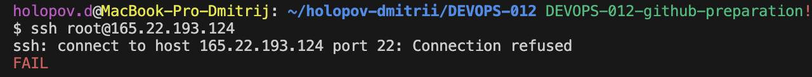

# Привет, время взглянуть на мою репу


Это мой репозиторий. Здесь вы найдете полезную информацию, включая мой публичный SSH-ключ с использованием алгоритма Ed25519.

Ed25519 — криптографическая схема цифровой подписи с высокой безопасностью , компактными ключами и подписями (32/64 байта), быстрой скоростью работы и простотой реализации .

---

## Мой публичный SSH-ключ

```plaintext
ssh-ed25519 AAAAC3NzaC1lZDI1NTE5AAAAIF/1JbX6alYyleTMFEmT8DvoeoaDAwlgdoAWFOZl6o+h Дмитрий@Home
```



## Как я сломал подключение:

1) apt update apt upgrade
2) mac уснул разорвав wifi с телефоном
3) терминал повис на моменте конфигурирования ssh сервера :) 